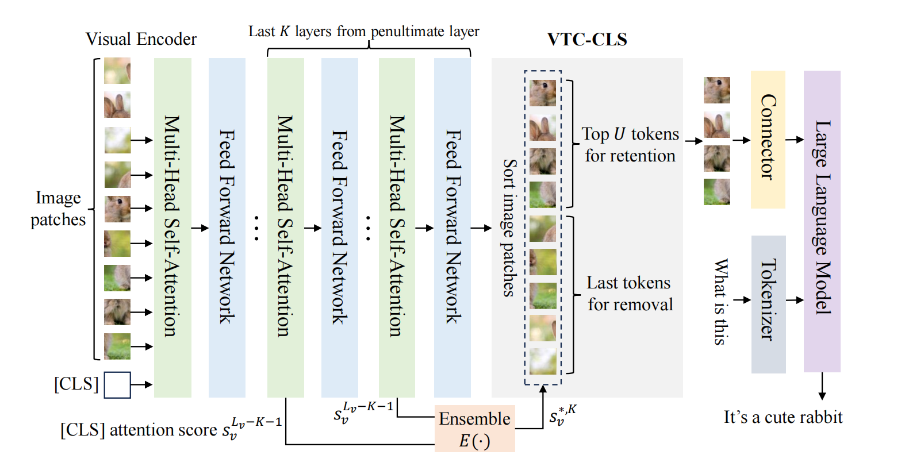
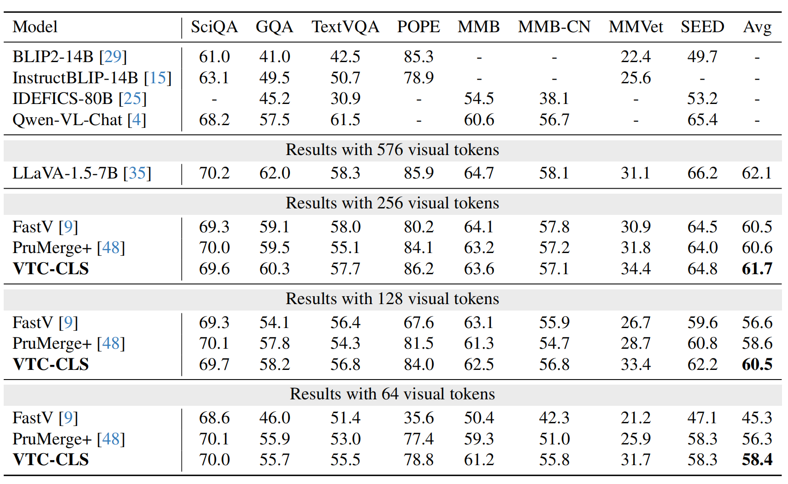
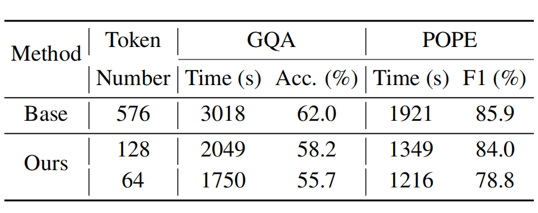

# [CLS] Token Tells Everything Needed for Training-free Efficient MLLMs

This is the official implementation of VTC-CLS, a state-of-the-art effective method for training-free visual token compression in Multimodal Large Language Models.

Our VTC-CLS is simple and can serve as a plug-and-play method to accelerate the inference of MLLMs in a training free manner, showing high practicality.

## News
- [x] [2024.12.10] we open-sourced our code!

## Environmental Setup
```bash
conda create -n prefixkv python=3.8
pip install -r requirements.txt
```
- Download [LLaVA-1.5-7B](https://huggingface.co/Zuyan/ElasticCache/tree/main/llava-v1.5-7b) and put it at `../models/`.

## Performance
We tested our VTC-CLS method on various models with different compression ratios, and display LLaVA results here. Compared with existing methods including FastV and LLaVA-prumerge, our method is state-of-the-art in training-free manner.




## Efficiency
We measure the evaluation time and show our method can effectively speed-up the inference process of MLLMs. We display the inference time of LLaVA-v1.5-7B on some test datasets before and after applying our VTC-CLS method. 


